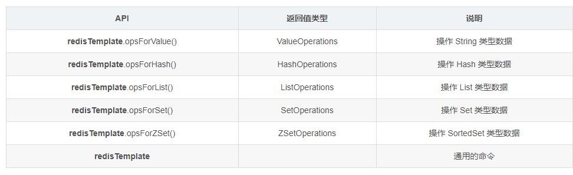

## SMALL SPRING PROJECT

> 后端技术栈为
> *  Springboot
> *  jwt和Spring Security授权
> *  mybatis、mybatis-plus等ORM框架

> redisTemplate使用


## Spring Security 
> 导入之后直接启动能够看到预定义的账号名和密码
> 
> 账号默认为user
> 密码自动生成

Spring Security 的本质是一个过滤器链
```java
FilterSecurityInterceptor 是一个方法级的权限过滤器，基本位于过滤链的最底部
ExceptionTranslationFilter 是一个异常过滤器，用来处理在认证授权过程中跑出的异常
UsernamePasswordAuthenticationFilter 对login的POST请求做拦截，校验表单中用户名和密码
```

> 如何使用Security

1、使用SpringSecurity 配置过滤器
* DelegatingFilterProxy


2、核心的两个接口
* UserDetailService ->自定义认证逻辑、
* PasswordEncoder ->进行用户密码的加密
3、创建一个类集成UsernamePasswordAuthenticationFilter

## Security 设置用户认证的三种方式
1、在配置文件中设置
2、在配置类中设置
```java
@Override
    protected void configure(AuthenticationManagerBuilder auth) throws Exception {
        String encode = passwordEncoder().encode("123");
        System.out.println(encode);
        auth.inMemoryAuthentication().withUser("lcy").password(encode).roles("admin");
    }
```
3、自定义UserDetailService的实现类进行设置

### 自定义实现类的设置
1、编写配置类，设置使用哪个userDetailService实现类
2、编写实现类，返回User对象，User对象有用户名密码和操作权限


